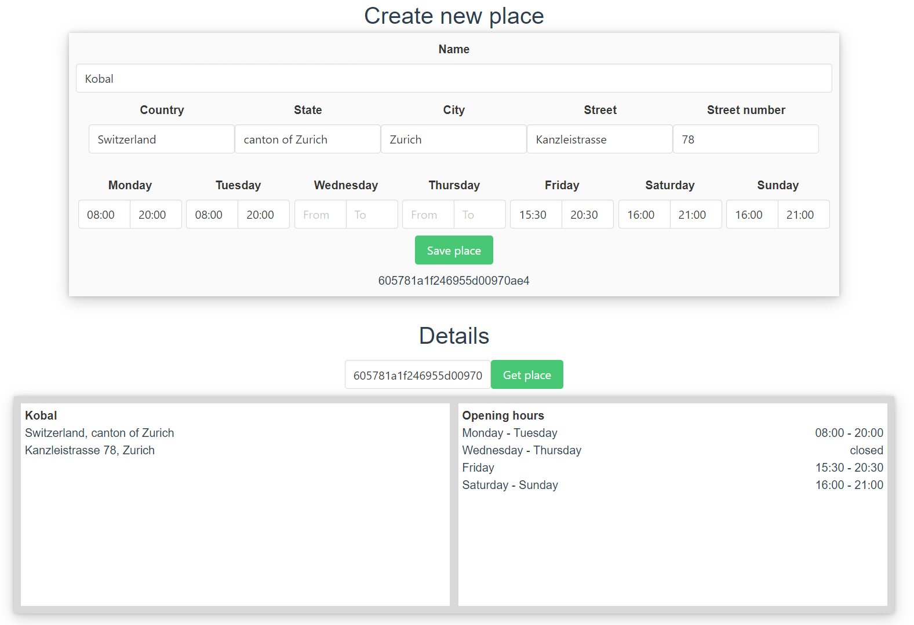

# Places
> Shows information about business entries


## Project setup
```
npm install
```

### Compiles and hot-reloads for development
```
npm run serve
```

### Compiles and minifies for production
```
npm run build
```

Sample

<br><b>
Due to lack of time, **frontend** can't handle multiple intervals of opening hours, but **API** is ready for this.
